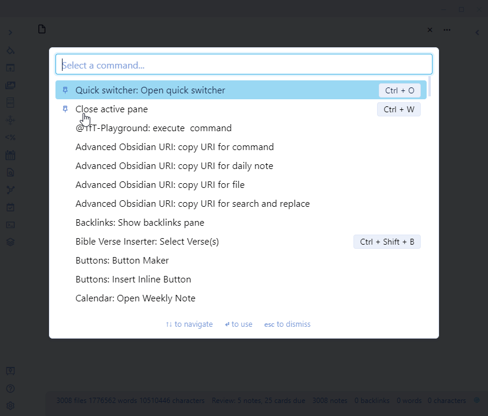

# Jump To Date Plugin for Obsidian
Quickly navigate to a Daily Notes Page using a popup calendar from  the ribbon or with a form that you type in a natural language date expression.

This plugin is part of the Obsidian42 family of Obsidian plugins. Check out the others:
- [Text Transporter](https://github.com/TfTHacker/obsidian42-text-transporter) - advanced text management for Obsidian. 
- [WordNet Dictionary](https://github.com/TfTHacker/Obsidian-WordNet) - WordNet is a large lexical database of English.

# From the Ribbon
Click the button in the ribbon to see the popup calendar. In the calendar, click on a date open the Daily Notes Page for that date.

# Using Natural Language Dates
From the command palette, invoke the Natural Language Date feature. Then using text to describe your date. For example:
- Today
- Tomorrow
- Next Friday
- May 5

**Note:** This feature requires that the Natural Language Dates Plugin is installed. 

# Other Features
- Hold down the control key when clicking on a date in the calendar popup to open it in a new pane
- Hold down control and shift to open in a new horizontal pane
- Right mouse click a date in the popup calendar to open the date in a new pane

# Manual Install
1. Create a folder in .obsidian/plugins
2. name the folder what you like. I personally call the folder: obsidian42-jump-to-date
3. go to this github link for releases: https://github.com/TfTHacker/obsidian42-jump-to-date/releases/ 
4. For the most current release, expand the assets and download main.js, manifest.js 
6. copy these 3 files: main.js, styles.css and manifest.json to the folder you created in step 1
7. restart obsidian 
8. Enable plugin in settings > community plugins. Should appear as "Obsidian42 - Jump-to-Date"

## Special thanks
- Thank you to Liam Cain for the use of his [obsidian-daily-notes-interface](https://github.com/liamcain/obsidian-daily-notes-interface) library for dealing with Daily Notes Page files
- Thank you to Argentina Ortega Sáinz for the [nldates-obsidian](https://github.com/argenos/nldates-obsidian) library, which assists with parsing Natural Language Dates

# Say Thank You
If you are enjoying this plugin then feel free to buying me a coffee on [https://ko-fi/TfTHacker](https://ko-fi.com/TfTHacker).

Please also help spread the word by sharing your enthusiasim for this plugin on Twitter, Reddit, or any other social media platform you regularly use. 

You can find me on Twitter [@TfTHacker](https://twitter.com/TfTHacker)

Also

- Bitcoin address: bc1qgx052tja4fsh5fv65rr6ceytj8zmjplvauxcuk
- Bitcoin cash: qp40hnhm24v785pyzl8dvsax9tzc2tur8vx32lshn4
- Ethereum address: 0xb29782A4EA6e02BbdF296671D8576bB045abf8AE
- Binance address: bnb18p4adhzlhvsxudkrduxqng9em992fj0raa5d6d
