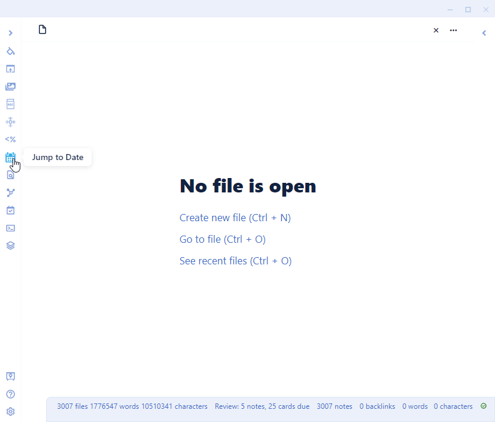

# Jump To Date Plugin for Obsidian

Quickly navigate to a Daily Notes Page using a popup calendar from the ribbon or with a form that you type in a natural language date expression.

Check out the documentation for this plugin at: https://tfthacker.com/jumptodate

## Ways to eonnect with me and more information on my work

You might also be interested in a few products I have made for Obsidian:

- [Canvas Candy](https://tfthacker.com/canvas-candy) - The Canvas Candy Vault is a set of tools specially designed for use with the canvas feature of Obsidian. With over 40+ decorations, you can add new dimensions to the cards on your canvas.
- [Cornell Notes Learning Vault](https://tfthacker.com/cornell-notes) - This vault teaches you how to use the Cornell Note-Taking System in your Obsidian vault. It includes learning material, samples, and Obsidian configuration files to enable Cornell Notes in your vault.

You can find me on Twitter [@TfTHacker](https://twitter.com/TfTHacker)

My website https://tfthacker.com/
